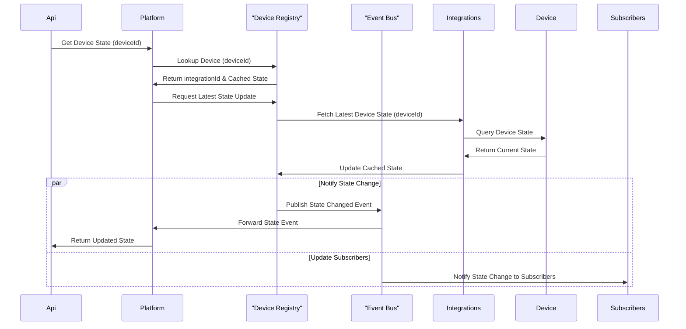
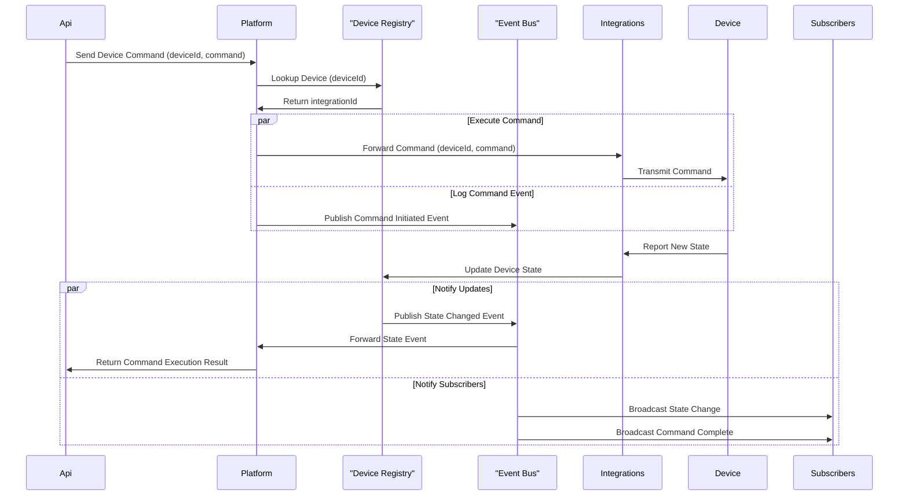
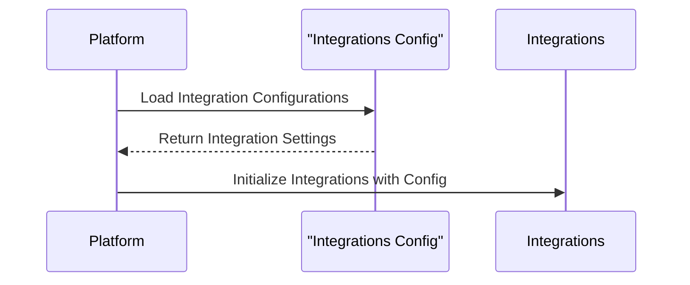
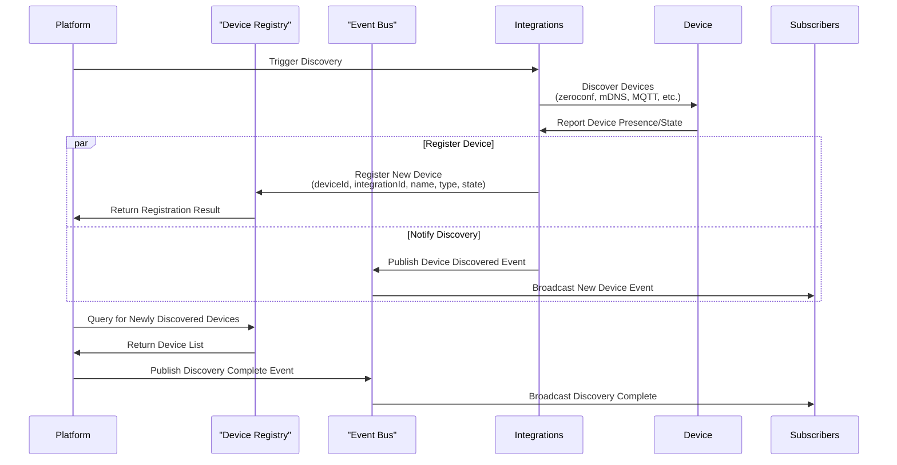
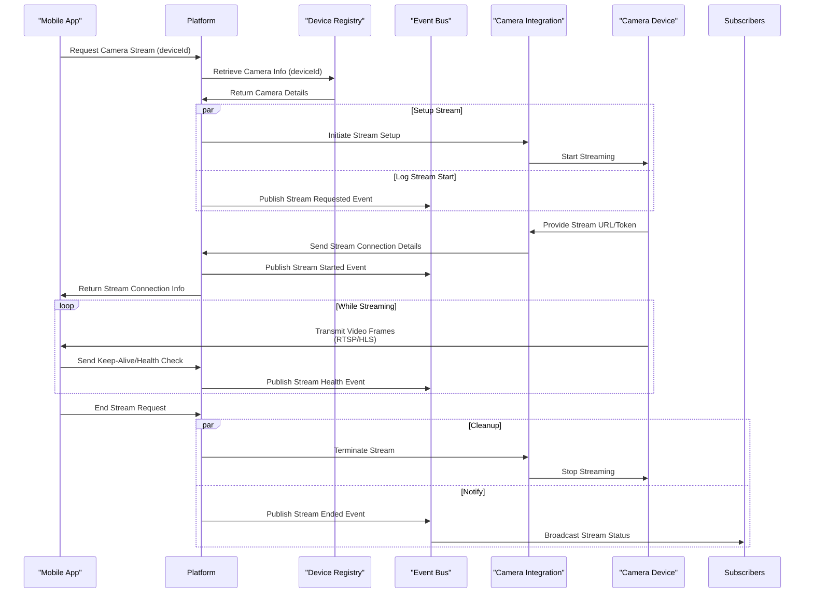
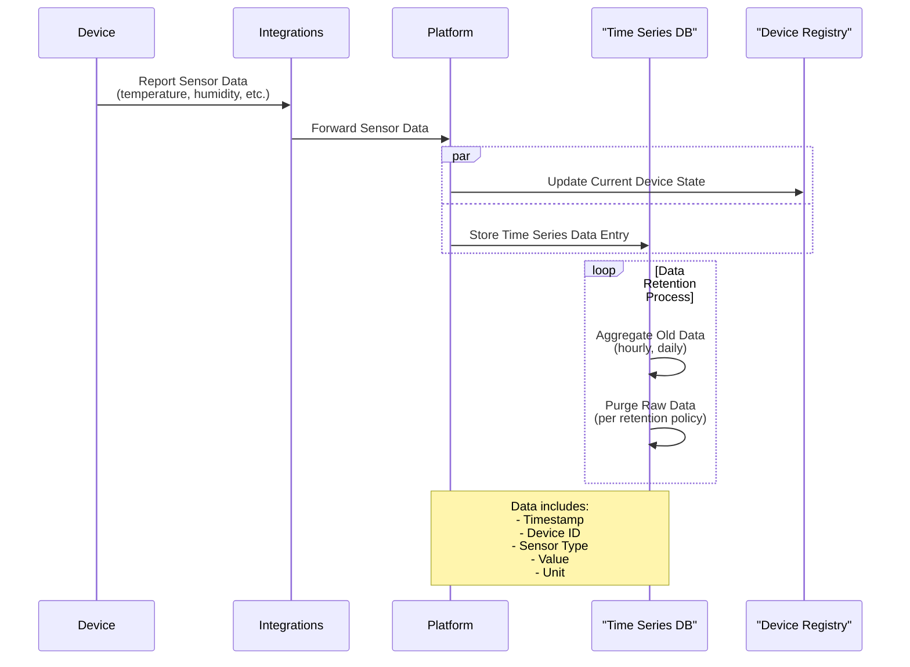
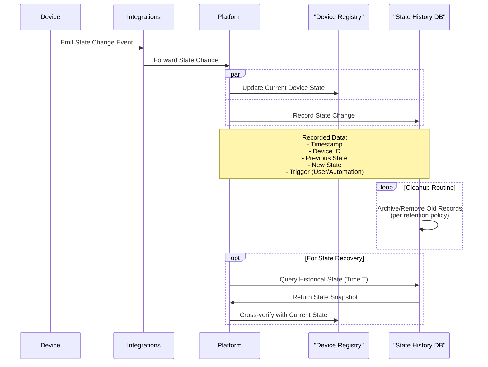
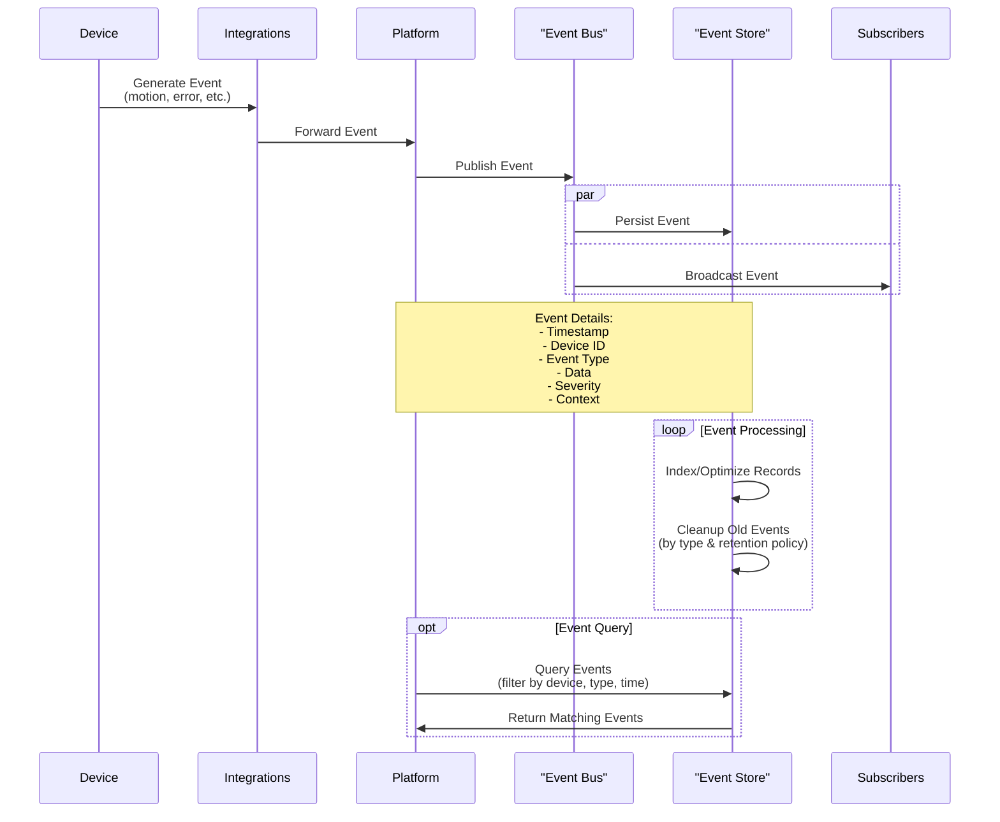
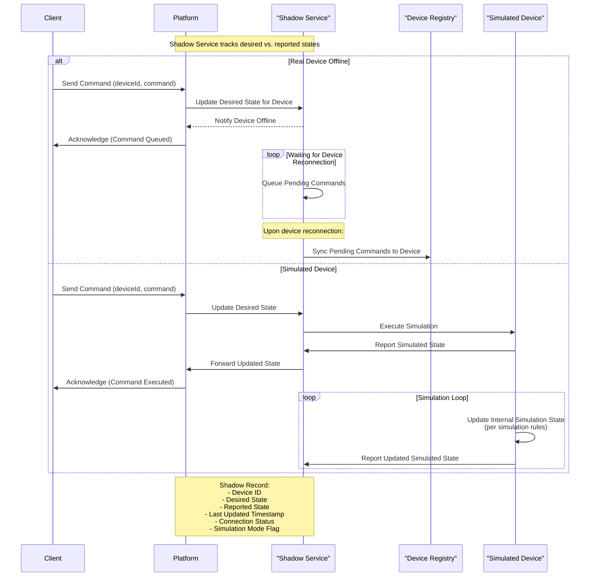

# Cove Platform Architecture

## Use Cases

- **Startup & Initialization:**
  - Startup Sequence
  - Initialize Integrations
- **Device Management:**
  - Discover Devices
  - Get Device State (Poll & Subscribe)
  - Send Device Command
  - Handle Device Shadow States & Simulation
- **Live Media:**
  - View Live Stream from Camera
- **Data Storage:**
  - Store Sensor Time Series Data
  - Store Device State History
  - Store Device Events

## Get Device State (Poll, Subscribe)

## Command Sequence

## Integration Initialization Sequence

## Device Discovery Sequence

## Camera Live Streaming Sequence

## Store Sensor Time Series Data

## Store Device State History

## Store Device Events

## Device Shadow State and Simulation

