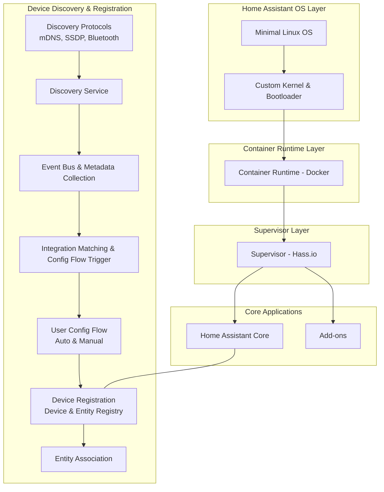

# Home Assistant Platform Architecture

Below is a Mermaid diagram that outlines the architecture of the entire Home Assistant platform:

# Detailed Integration Matching & Config Flow Trigger

Below is the Mermaid diagram that goes deeper into how Home Assistant handles integration matching and configuration flow triggering:

```mermaid
flowchart TD
  subgraph "Integration Matching & Config Flow Trigger"
    A[Receive Discovery Metadata<br/>device type, manufacturer, model, unique ID]
    B[Extract Key Attributes<br/>e.g., MAC address, model name]
    C[Check Manufacturer & Model<br/>for compatibility]
    D[Lookup Integration Manifest<br/>supported devices, version requirements]
    E[Determine Device Version & Capabilities]
    F[Check for Existing Configuration<br/>prevent duplicates]
    G{Is Device New?}
    H[Trigger Integration's Config Flow Handler]
    I[Auto-Populate Configuration Fields<br/>using discovery metadata]
    J[Prompt User for Additional Input<br/>e.g., API key, confirmation]
    K[Create/Update Configuration Entry<br/>register device in registry]
    L[Abort/Skip if Already Configured]

    A --> B
    B --> C
    C --> D
    D --> E
    E --> F
    F --> G
    G -- Yes --> H
    G -- No --> L
    H --> I
    I --> J
    J --> K
  end
```

